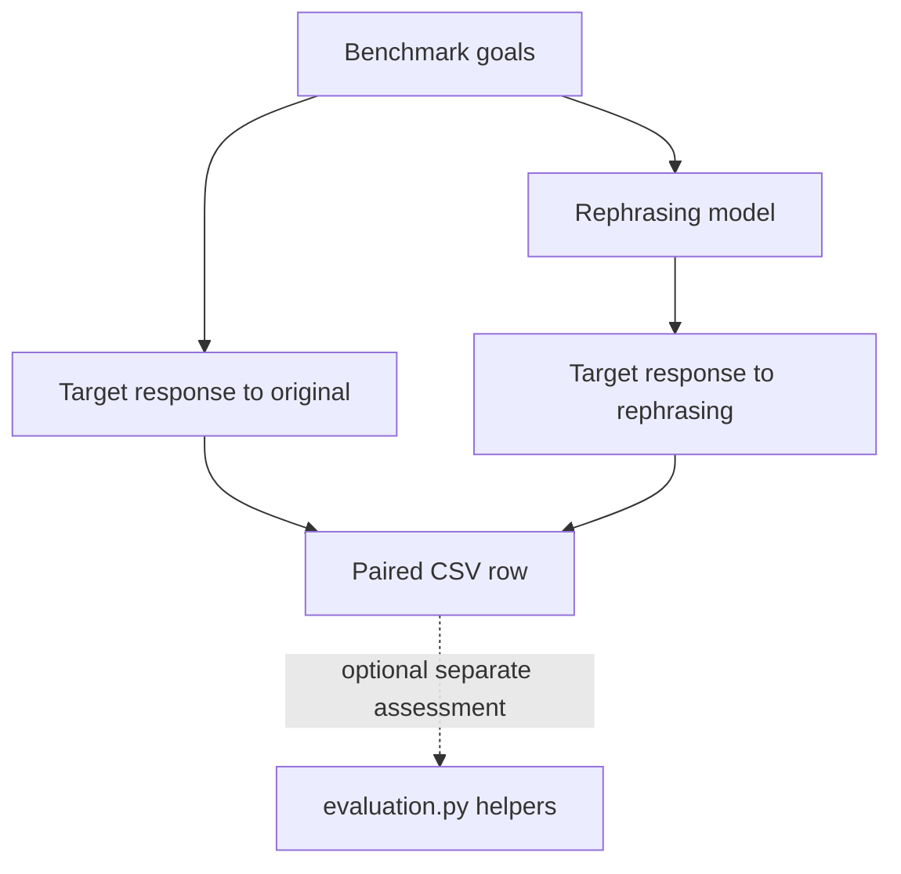

# addition-before-subversion, explained for a human

A small adversarial-evaluation script compares model responses to original benchmark prompts and versions rephrased as mathematics questions. It records paired outputs so the change in wording can be examined.

## How it flows

`main.py` downloads benchmark goals, chooses its local or hosted branch, and opens a CSV. For each goal it queries the target directly, asks a second model for a mathematical rephrasing, then queries the target with that rephrasing. The separate `evaluation.py` contains a scoring-prompt helper and judge call, but `main.py` does not invoke them.

## Where to look

| File or folder | What it does |
| --- | --- |
| `main.py` | Top-level branch selection, paired queries, and CSV writing. |
| `benchmark_loader.py` | Download the AdvBench goal column; return an empty list on failure. |
| `primer_crafting.py; api_primer_crafting.py` | Local Ollama and hosted rephrasing helpers. |
| `ollama_client.py; api_client.py` | Target-model request helpers. |
| `evaluation.py` | Separate judge prompt construction and request helper. |

## Results and failure paths

The main script writes `data/output.csv` and flushes after each prompt. It opens that path in write mode at module scope, so even importing `main.py` can truncate an existing output file. Despite their names, the chat-with-memory helpers send a single message with no accumulated conversation. Benchmark download failure produces no examples; other request errors propagate. Local response parsing expects a thinking field, which may be absent for some models.

## A useful reading order

Read the local/API branches in `main.py`, then the corresponding client and rephrasing helpers. Read `evaluation.py` separately to see the assessment that is available but not wired into the main loop.
